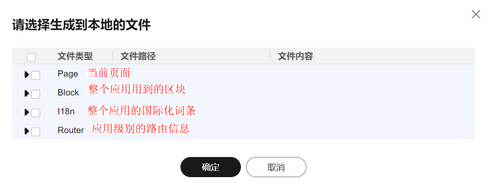

## Usage of Generated Source Code

    This scaffold solves the problem of running after downloading the source code.

<b> Note: The template project started by low-code applications is based on the Tiny Vue component library.</b> 

<br>

- Start this project：
  ```npm run dev```

<br>

When downloading the source code from the upper right corner of the engine, you can select the source code to be generated as required.
</br>



After you click OK, the engine automatically generates a src folder that contains the selected content.
For first-time users, you are advised to create a simple page that does not contain internationalization. Then copy the generated page to the src/view directory of the project and run it directly.

For users who use the source code for multiple times, you are advised to select the src of the project when generating the source code. When generating the source code, generate the corresponding file as required.

