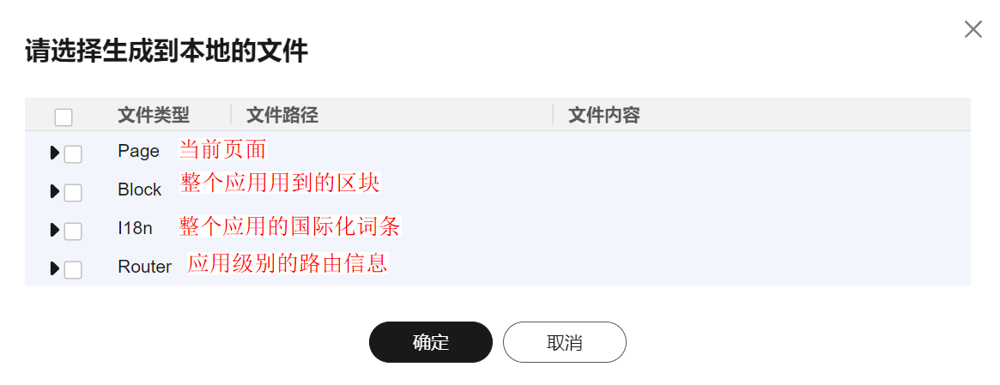

## 生成源码的使用方式

    本脚手架解决下载源代码后的运行问题。

<b> 注意：低代码应用启动的模板工程，基于 Tiny Vue 组件库</b> 

 

- 启动本项目：
  npm run dev

 

在通过引擎的右上角下载源码的时，可以根据需要选择要生成的源代码。
 

点击确定后，引擎会自动生成一个src的文件夹, 里面包含了勾选的内容。
对于初次使用的用户，建议搭建一个简单的页面，不包含国际化等内容。然后把生成的页面拷贝到本项目的src/view目录直接运行起来。

对于多次使用的用户，建议生成源码的时候，直接选择本项目的src。然后再生成源代码的时候，按需生成对应的文件即可。
  
