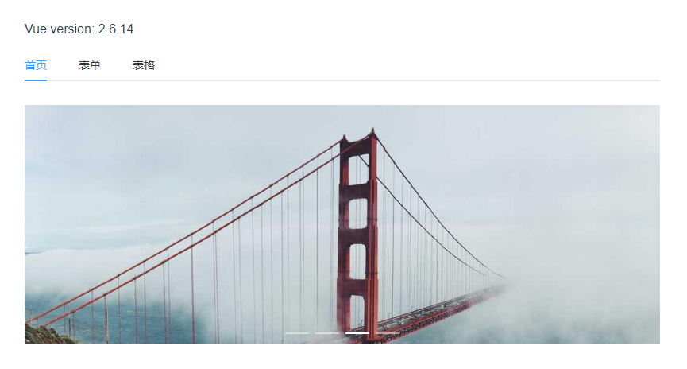
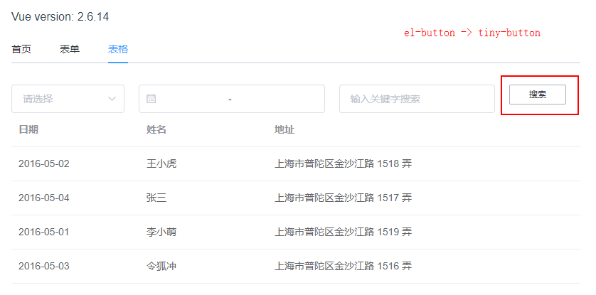
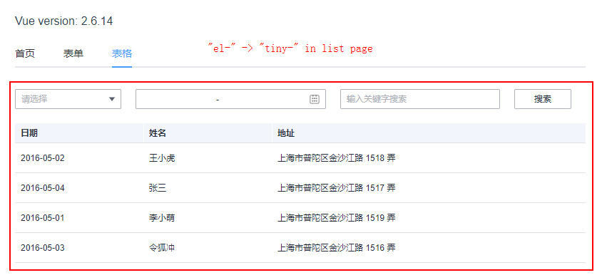
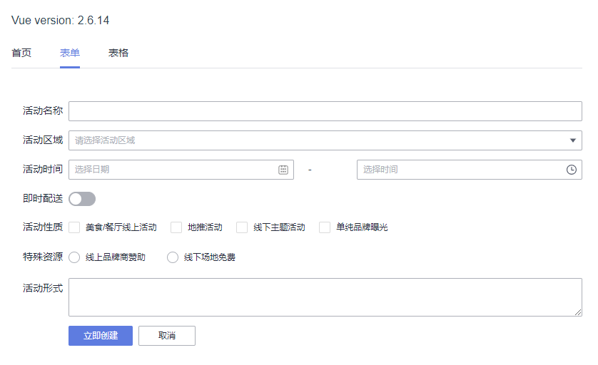
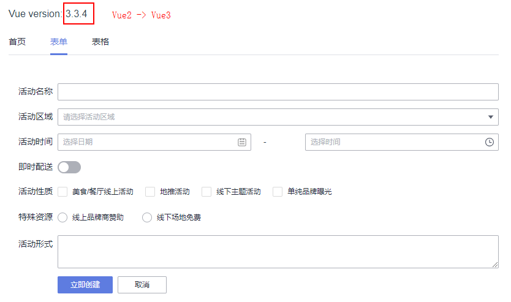

# element-to-opentiny

This is a Vue2 project based on the ElementUI component library, using the following components of the ElementUI component library:
1. Carousel
2. Select
3. DatePicker
4. Input
5. Button
6. Table
7. Tabs
8. Form
9. TimePicker
10. Switch
11. Checkbox
12. Radio

## Development

You can start by executing the following command from the root of the project:

```shell
pnpm --filter element-to-opentiny dev
```

Or you can execute the following command under the `packages/element-to-opentiny` sub-package project to launch:

```shell
npm run dev
```

The effect after startup is as follows:



Now we need to upgrade this project to a Vue3 project that uses the OpenTiny component library.

It is mainly divided into the following steps:

1. Replace a component with a component of OpenTiny
2. Replace all components of a page with components of OpenTiny
3. Replace all components of the entire application with components of OpenTiny.
4. Upgrade the project from Vue2 to Vue3

## Replace a component with a component of OpenTiny

Install the `@opentiny/vue@2` component library first.

```shell
npm i @ opentiny/vue@2
```

Import the OpenTiny Vue component library into the `main.js` file.

```ts
import TinyVue from'@ opentiny/vue'

Vue.use(TinyVue)
```

Take the Button component of the table page as an example, replace the `el-button` with `tiny-button` in the `ListPage.vue` file.

```html
<el-button>Search</el-button>
->
<tiny-button>Search</tiny-button>
```

The effect is as follows:



## Replace all components of a page with components of OpenTiny

Take the `ListPage` table page as an example, directly change the `el-` component prefix to `tiny-` of the entire template.

The effect is as follows:



## Replace all components of the entire application with those of OpenTiny

The page involved:

- HomePage: Carousel
- ListPage: Select / DatePicker / Input / Button / Table
- FormPage: Form / TimePicker / Switch / Checkbox / Radio
- App: Tabs

The replacement method is the same as the previous one. To replace `el-` with `tiny-`, you should pay attention to:

- `tabs` component `tab-click -> click`, `el-tab-pane -> tiny-tab-item`
- change `label` of `tab-pane` to `title` of `tab-item`

The effect is as follows:



## Upgrade the project from Vue2 to Vue3

The steps are as follows:

Step 1: Install gogocode

```shell
npm install gogocode-cli -g
```

Step 2: Convert the source code

```shell
gogocode -s ./src -t gogocode-plugin-vue -o ./src
```

Step 3: Upgrade dependency

```shell
gogocode -s package.json -t gogocode-plugin-vue -o package.json
```

Step 4: Upgrade the OpenTiny Vue component library to version 3.0

```shell
npm i @ opentiny/vue@3
```

The component code does not need to be modified, and the Vue2 project is smoothly upgraded to Vue3.



Congratulations on completing the upgrade!🎉
