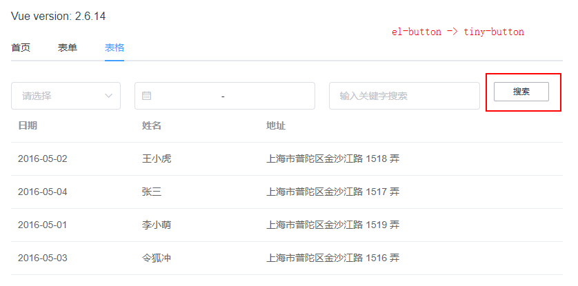
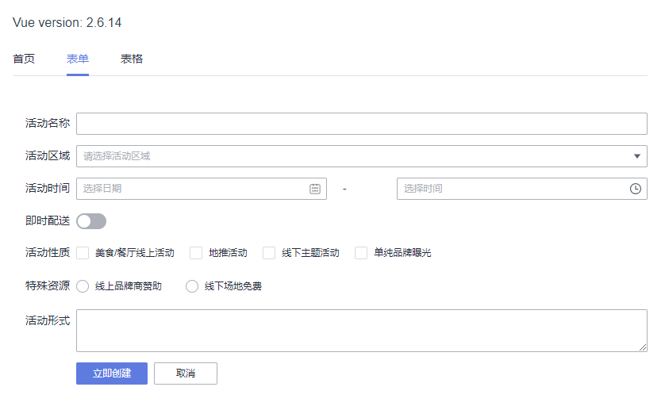
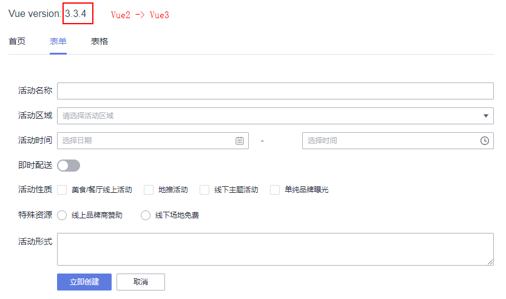

# element-to-opentiny

这是一个基于 ElementUI 组件库的 Vue2 项目，使用了 ElementUI 组件库的以下组件：
1. Carousel
2. Select
3. DatePicker
4. Input
5. Button
6. Table
7. Tabs
8. Form
9. TimePicker
10. Switch
11. Checkbox
12. Radio

## 本地启动

可以通过在项目根目录执行以下命令进行启动：

```shell
pnpm --filter element-to-opentiny dev`
```

或者你也可以在 `packages/element-to-opentiny` 子包项目下面执行以下命令进行启动：

```shell
npm run dev
```

启动之后效果如下：


现在我们需要将这个项目升级到使用 OpenTiny 组件库的 Vue3 项目。

主要分成以下几个步骤：

1. 将一个组件替换成 OpenTiny 的组件
2. 将一个页面的所有组件替换成 OpenTiny 的组件
3. 将整个应用的所有组件替换成 OpenTiny 的组件
4. 将项目由 Vue2 升级到 Vue3

## 将一个组件替换成 OpenTiny 的组件

先安装 `@opentiny/vue@2` 组件库。

```shell
npm i @opentiny/vue@2
```

在 `main.js` 文件中引入 OpenTiny Vue 组件库。

```ts
import TinyVue from '@opentiny/vue'

Vue.use(TinyVue)
```

以表格页面的 Button 组件为例，将 `src/components/ListPage.vue` 文件中的 `el-button` 换成 `tiny-button`。

```html
<el-button>搜索</el-button>
->
<tiny-button>搜索</tiny-button>
```

效果如下：



## 将一个页面的所有组件替换成 OpenTiny 的组件

以 `ListPage` 表格页面为例，直接把整个模板的 `el-` 组件前缀改成 `tiny-` 组件前缀即可。

效果如下：


## 将整个应用的所有组件替换成 OpenTiny 的组件

涉及页面：

- HomePage 首页：Carousel
- ListPage 表格页面：Select、DatePicker、Input、Button、Table
- FormPage 表单页面：Form、TimePicker、Switch、Checkbox、Radio
- App 应用首页：Tabs

替换方式和前面的方式一样，将 `el-` 替换成 `tiny-`，需要注意：

- `tabs` 组件的 `tab-click -> click`，`el-tab-pane -> tiny-tab-item`
- `tab-pane` 的 `label` 改成 `tab-item` 的 `title`

效果如下：



## 将项目由 Vue2 升级到 Vue3

步骤如下：

第一步：安装 gogocode

```shell
npm install gogocode-cli -g
```

第二步：转换源码

```shell
gogocode -s ./src -t gogocode-plugin-vue -o ./src
```

第三步：升级依赖

```shell
gogocode -s package.json -t gogocode-plugin-vue -o package.json
```

第四步：升级 OpenTiny Vue 组件库到 3.0 版本

```shell
npm i @opentiny/vue@3
```

组件代码无需做任何修改，完成 Vue2 项目平滑升级到 Vue3。



恭喜你完成升级！🎉
